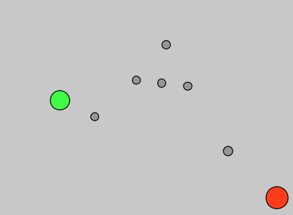
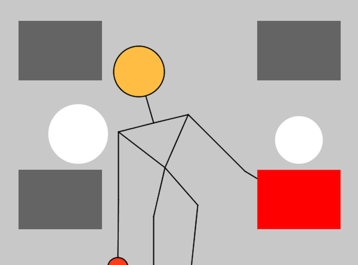
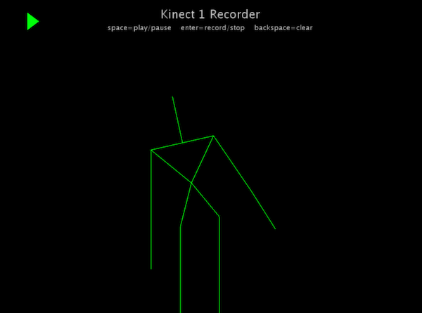
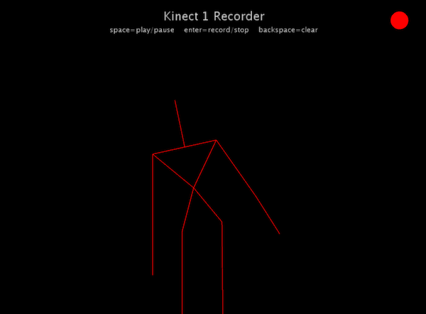

# Kinect1Processing

Sketches for **Processing 2** with **Kinect v1**. They require the **SimpleOpenNI** library ([Download page](https://code.google.com/archive/p/simple-openni/downloads)).

These sketches will **not** work with Processing 3 and also - of course - not with the Kinect v2.

I developed these sketches for my course [Interaction Engineering](http://interaction.hs-augsburg.de) at Augsburg University of Applied Sciences, as explained in my [Kinect chapter](http://michaelkipp.de/interaction/kinect.html) (German) of my course notes.

## Kinect1Joints

Very simple sketch to visualize some of the joints you get from the Kinect.

## Kinect1Interaction2D

Lets you interact with rectangles and circles on a 2D plane. Look at my course notes for more information.

## Kinect1Recorder

This sketch allows you to record a piece of motion by hitting the ENTER key (once for starting, once more for stopping). You can playback your recording with the SPACE key. There can only be one motion sequence stored at any time.

*(c) 2018 [Michael Kipp](http://michaelkipp.de)*
